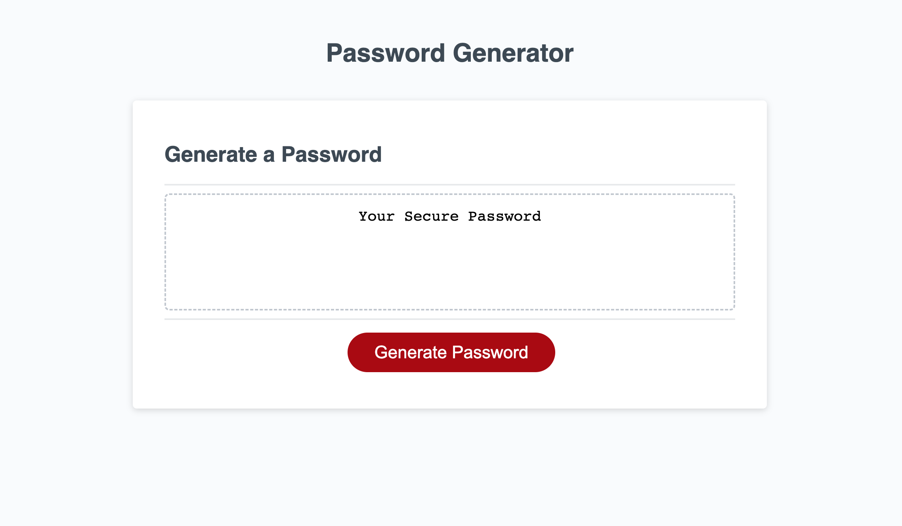
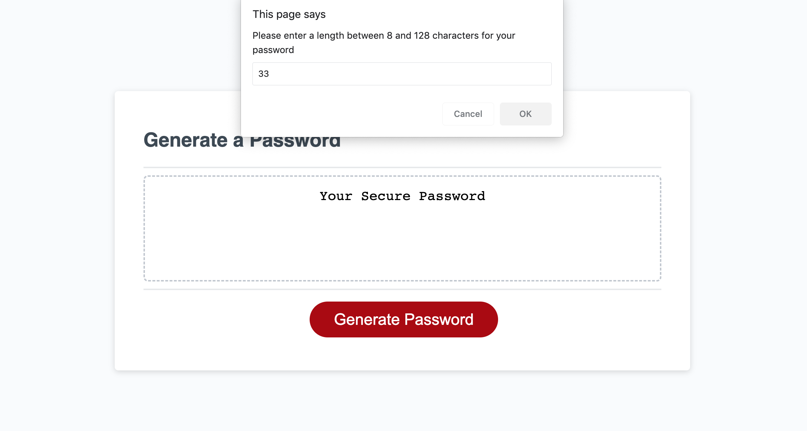
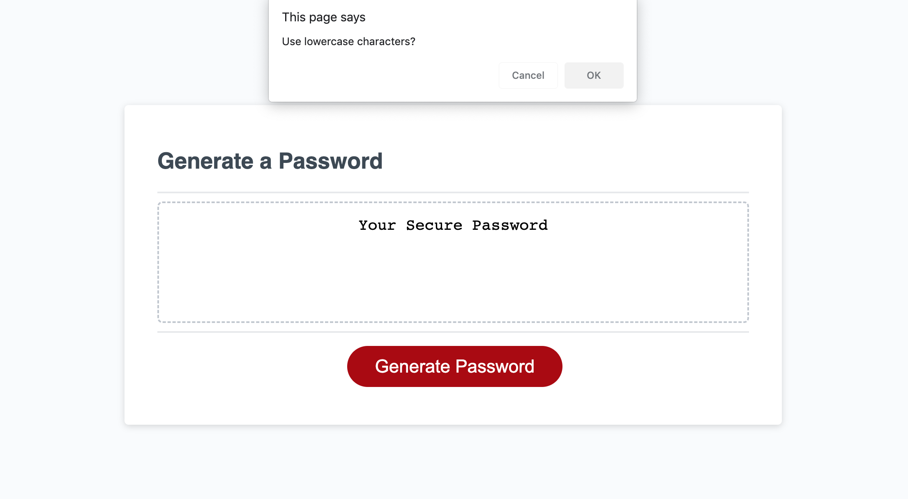
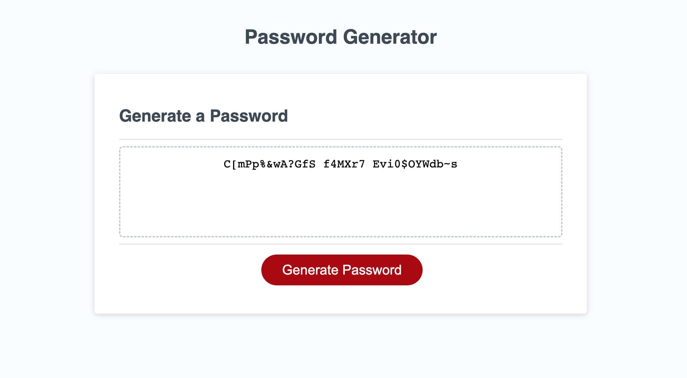

# PasswordGenerator
## Table of Contents
* [Description](#description)
* [Screenshots](#screenshots)
* [Code Snippets](#code-snippets)
* [Technologies Used](#technologies-used)
* [Credits](#credits)
* [Author Links](#author-links)

***

## Description
This application enables employees to generate random passwords based on criteria that they’ve selected. The employee is asked to specify a length and the character sets - lowercase, uppercase, numbers, and special characters - to use in the password. This app runs in the browser and features HTML and CSS along with JavaScript code. It has a responsive user interface that adapts to multiple screen sizes. The page has been deployed to the Github Pages at [Password Generator](https://sbhikshe.github.io/PasswordGenerator/)


## Screenshots

### *1. Main Password Generator screen*


### *2. Ask the user to input a desired length*


### *3. Ask the user to choose among character sets. Tthis is one of the screens.*


### *4. Display the generated random password to the user.*

***

## Code Snippets
### *1. Show a series of confirmation boxes to the user to pick the character sets to use in the password.*
```
  /* get the user's choices: lower, upper, numeric, and/or special */
  /* and set the appropriate flags */

  alert("Please choose atleast one of the following sets of characters to use in your password");
  if (confirm("Use lowercase characters?")) {
    useLower = true;
  };
  if (confirm("Use uppercase characters?")) {
    useUpper = true;
  };
  if (confirm("Use numeric characters?")) {
    useNumeric = true;
  };
  if (confirm("Use special characters?")) {
    useSpecial = true;
  };

```

### *2. A master array contains all the characters from the character sets the user picked - lowercase, uppercase, numeric or special characters. This piece of code generates a random index into the master array and picks the corresponding character to add to the password. This code will pick as many characters as the length desired by the user, and form the password string.*
```
  /* get a random character from master array */
  /* stick it in the password */
  for (var i = 0; i < passwordLength; i++) {
    randomCharIndex = Math.floor(Math.random() * masterCharSet.length);
    password += masterCharSet[randomCharIndex];
  }

```

***
## Technologies Used
- HTML
- CSS
- JavaScript

## Credits
[JavaScript Popup Boxes](https://www.w3schools.com/js/js_popup.asp)\
[Math.random](https://developer.mozilla.org/en-US/docs/Web/JavaScript/Reference/Global_Objects/Math/random)\
[Password Special Characters](https://owasp.org/www-community/password-special-characters)

## Author Links
[LinkedIn](https://www.linkedin.com/in/sripriya-bhikshesvaran-8520992/)\
[Github](https://github.com/sbhikshe)
